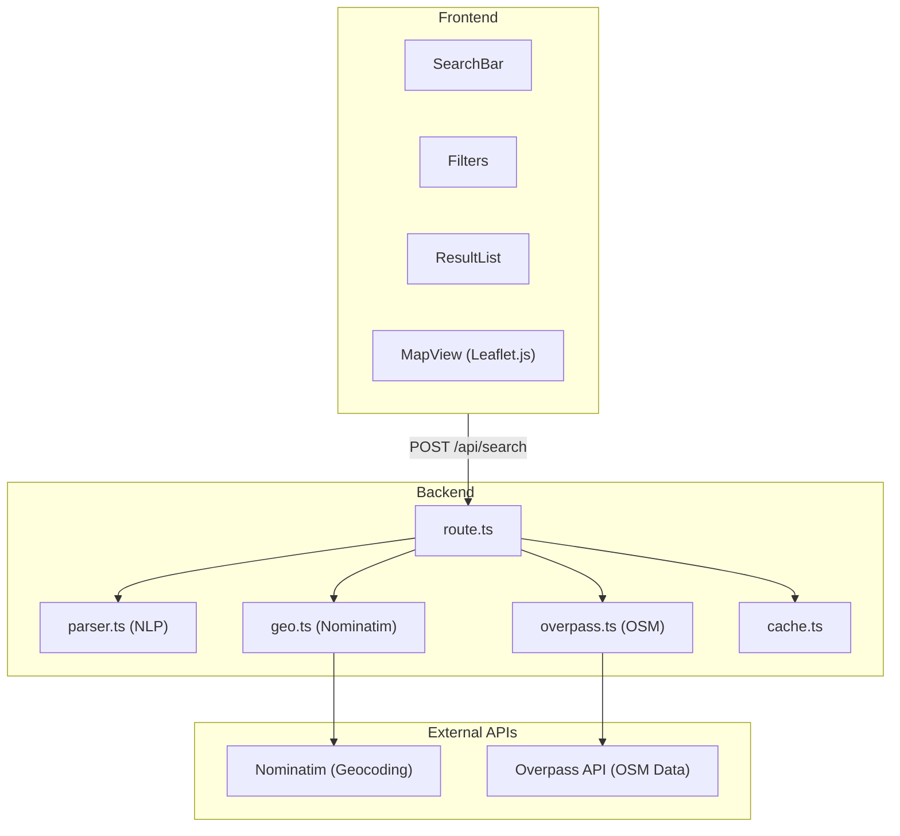

# Sightline

Geospatial infrastructure intelligence platform for discovering and analyzing physical-world assets using OpenStreetMap data.


## Overview

Sightline enables searching, monitoring, and analyzing real-world infrastructure including:

- Telecommunications towers
- Power plants and substations
- Data centers
- Airports and helipads
- Ports and harbours
- Warehouses and industrial facilities
- Pipelines and refineries
- Military installations
- Hospitals, prisons, embassies
- Surveillance cameras and security infrastructure

And many more asset types across 20+ categories with over 150 searchable infrastructure types.

## Architecture



## Data Sources

### OpenStreetMap

All infrastructure data comes from [OpenStreetMap](https://www.openstreetmap.org/), a collaborative mapping project. OSM data is crowd-sourced and may contain inaccuracies or gaps.

### Nominatim

Geographic resolution uses the [Nominatim](https://nominatim.openstreetmap.org/) geocoding service to convert place names to bounding boxes and coordinates.

### Overpass API

Infrastructure queries execute against the [Overpass API](https://overpass-api.de/), which provides read-only access to OSM data.

## Query Syntax

### Natural Language

```
telecom towers in karnataka
power plants near mumbai
data centers in california
airports in germany
```

### Structured Queries

```
type:telecom operator:airtel region:karnataka
type:data_center operator:google
type:substation region:texas
type:airport country:france
```

### Supported Parameters

| Parameter | Description | Example |
|-----------|-------------|---------|
| `type:` | Asset type | `type:power_plant` |
| `operator:` | Operator/owner | `operator:google` |
| `region:` | State/region | `region:bavaria` |
| `country:` | Country | `country:india` |
| `near:` | Proximity search | `near:london` |
| `radius:` | Search radius (km) | `radius:100` |

### Supported Asset Types

#### Energy & Power
| Type | Aliases | Description |
|------|---------|-------------|
| `power_plant` | `powerplant` | Power generation facilities |
| `substation` | - | Electrical substations |
| `transformer` | - | Power transformers |
| `power_line` | - | High voltage power lines |
| `power_pole` | - | Power distribution poles |
| `solar` | - | Solar farms and panels |
| `wind` | - | Wind farms and turbines |
| `nuclear` | `nuclear_site` | Nuclear power plants |
| `hydroelectric` | - | Hydroelectric plants |
| `geothermal` | - | Geothermal plants |
| `coal` | - | Coal power plants |
| `gas_power` | - | Gas power plants |
| `oil_power` | - | Oil power plants |
| `biogas` | - | Biogas plants |
| `biomass` | - | Biomass plants |
| `tidal` | - | Tidal power plants |

#### Telecommunications
| Type | Aliases | Description |
|------|---------|-------------|
| `telecom` | `tower` | Telecom towers |
| `antenna` | - | Antennas |
| `mast` | - | Communication masts |
| `cell_tower` | - | Mobile cell towers |
| `radio_tower` | - | Radio transmission towers |
| `broadcast_tower` | - | TV/Radio broadcast towers |
| `satellite_dish` | - | Satellite dishes |
| `telephone_exchange` | - | Telephone exchanges |
| `data_center` | `datacenter` | Data centers |

#### Oil, Gas & Mining
| Type | Aliases | Description |
|------|---------|-------------|
| `refinery` | - | Oil refineries |
| `pipeline` | - | Pipelines |
| `oil_well` | - | Oil extraction wells |
| `gas_well` | - | Gas extraction wells |
| `storage_tank` | - | Fuel/liquid storage tanks |
| `silo` | - | Storage silos |
| `gasometer` | - | Gas storage tanks |
| `quarry` | `mine` | Quarries and mines |
| `landfill` | - | Landfill sites |
| `scrap_yard` | - | Scrap yards |

#### Water & Utilities
| Type | Aliases | Description |
|------|---------|-------------|
| `water_tower` | - | Water towers |
| `water_treatment` | - | Water treatment plants |
| `wastewater` | `sewage`, `sewage_plant` | Wastewater plants |
| `dam` | - | Dams |
| `reservoir` | - | Reservoirs |
| `pumping_station` | - | Water pumping stations |
| `water_well` | - | Water wells |

#### Aviation
| Type | Aliases | Description |
|------|---------|-------------|
| `airport` | - | Airports |
| `helipad` | - | Helipads |
| `airfield` | - | Military/private airfields |
| `runway` | - | Airport runways |
| `taxiway` | - | Airport taxiways |
| `terminal` | - | Airport terminals |
| `hangar` | - | Aircraft hangars |
| `atc_tower` | - | Air traffic control towers |

#### Maritime
| Type | Aliases | Description |
|------|---------|-------------|
| `port` | `seaport` | Ports and seaports |
| `harbour` | - | Harbours |
| `ferry_terminal` | - | Ferry terminals |
| `marina` | - | Marinas |
| `shipyard` | - | Shipyards |
| `dock` | - | Docks |
| `lighthouse` | - | Lighthouses |

#### Rail & Transit
| Type | Aliases | Description |
|------|---------|-------------|
| `train_station` | - | Train stations |
| `railyard` | `rail_yard` | Rail yards |
| `metro` | - | Metro/subway stations |
| `tram_stop` | - | Tram stops |
| `halt` | - | Railway halts |
| `level_crossing` | - | Level crossings |
| `bus_station` | - | Bus stations |
| `parking` | - | Parking facilities |
| `toll_booth` | - | Toll booths |
| `weigh_station` | - | Truck weigh stations |
| `rest_area` | - | Highway rest areas |
| `service_area` | - | Highway service areas |

#### Structures
| Type | Aliases | Description |
|------|---------|-------------|
| `bridge` | - | Bridges |
| `tunnel` | - | Tunnels |
| `cooling_tower` | - | Cooling towers |
| `chimney` | - | Industrial chimneys |
| `crane` | - | Cranes |
| `windmill` | - | Windmills |
| `watermill` | - | Watermills |
| `clock_tower` | - | Clock towers |
| `bell_tower` | - | Bell towers |

#### Industrial & Commercial
| Type | Aliases | Description |
|------|---------|-------------|
| `warehouse` | - | Warehouses |
| `factory` | - | Factories |
| `industrial` | - | Industrial zones |
| `works` | - | Industrial works |
| `depot` | - | Depots |
| `brewery` | - | Breweries |
| `distillery` | - | Distilleries |
| `sawmill` | - | Sawmills |
| `slaughterhouse` | - | Slaughterhouses |
| `recycling_plant` | `recycling` | Recycling plants |

#### Military & Defense
| Type | Aliases | Description |
|------|---------|-------------|
| `military` | - | Military installations |
| `bunker` | - | Bunkers |
| `barracks` | - | Military barracks |
| `naval_base` | - | Naval bases |
| `range` | - | Firing/shooting ranges |
| `checkpoint` | - | Military checkpoints |
| `radar` | - | Radar installations |

#### Government & Public Safety
| Type | Aliases | Description |
|------|---------|-------------|
| `embassy` | - | Embassies |
| `courthouse` | - | Courthouses |
| `townhall` | - | Town halls |
| `government` | - | Government offices |
| `customs` | - | Customs offices |
| `tax_office` | - | Tax offices |
| `border_control` | - | Border control points |
| `police` | - | Police stations |
| `fire_station` | - | Fire stations |
| `prison` | - | Prisons |
| `ambulance_station` | - | Ambulance stations |
| `rescue_station` | - | Rescue stations |
| `coast_guard` | - | Coast guard stations |
| `emergency_phone` | - | Emergency phones |
| `fire_hydrant` | - | Fire hydrants |
| `lifeguard` | - | Lifeguard stations |
| `surveillance_camera` | `cctv` | Surveillance cameras |

#### Education & Research
| Type | Aliases | Description |
|------|---------|-------------|
| `school` | - | Schools |
| `university` | - | Universities |
| `college` | - | Colleges |
| `kindergarten` | - | Kindergartens |
| `driving_school` | - | Driving schools |
| `research` | - | Research institutes |
| `library` | - | Libraries |

#### Healthcare
| Type | Aliases | Description |
|------|---------|-------------|
| `hospital` | - | Hospitals |
| `clinic` | - | Clinics |
| `pharmacy` | - | Pharmacies |
| `dentist` | - | Dental practices |
| `veterinary` | - | Veterinary clinics |
| `nursing_home` | - | Nursing homes |
| `hospice` | - | Hospices |
| `blood_bank` | - | Blood banks |

#### Culture & Entertainment
| Type | Aliases | Description |
|------|---------|-------------|
| `museum` | - | Museums |
| `theatre` | - | Theatres |
| `cinema` | - | Cinemas |
| `stadium` | - | Stadiums |
| `sports_centre` | - | Sports centres |
| `swimming_pool` | - | Swimming pools |
| `golf_course` | - | Golf courses |
| `racetrack` | - | Racetracks |
| `ice_rink` | - | Ice rinks |

#### Tourism & Leisure
| Type | Aliases | Description |
|------|---------|-------------|
| `hotel` | - | Hotels |
| `campsite` | - | Campsites |
| `caravan_site` | - | Caravan sites |
| `theme_park` | - | Theme parks |
| `zoo` | - | Zoos |
| `aquarium` | - | Aquariums |
| `viewpoint` | - | Viewpoints |
| `attraction` | - | Tourist attractions |

#### Religious
| Type | Aliases | Description |
|------|---------|-------------|
| `church` | - | Churches |
| `mosque` | - | Mosques |
| `temple` | - | Temples |
| `synagogue` | - | Synagogues |
| `place_of_worship` | - | General places of worship |
| `cemetery` | - | Cemeteries |

#### Historic
| Type | Aliases | Description |
|------|---------|-------------|
| `monument` | - | Monuments |
| `memorial` | - | Memorials |
| `castle` | - | Castles |
| `fort` | - | Forts |
| `ruins` | - | Ruins |
| `archaeological_site` | - | Archaeological sites |
| `observatory` | - | Observatories |

#### Agriculture
| Type | Aliases | Description |
|------|---------|-------------|
| `farm` | - | Farms |
| `greenhouse` | - | Greenhouses |
| `orchard` | - | Orchards |
| `vineyard` | - | Vineyards |

#### Services
| Type | Aliases | Description |
|------|---------|-------------|
| `bank` | - | Banks |
| `atm` | - | ATMs |
| `post_office` | - | Post offices |
| `fuel` | `gas_station`, `petrol` | Fuel stations |
| `charging_station` | - | EV charging stations |

## Development

### Prerequisites

- Node.js 18+
- npm

### Setup

```bash
npm install
npm run dev
```

Open [http://localhost:3000](http://localhost:3000).

### Project Structure

```
app/
├── page.tsx              # Main application page
├── layout.tsx            # Root layout
├── globals.css           # Global styles
└── api/
    └── search/
        └── route.ts      # Search API endpoint

components/
├── SearchBar.tsx         # Query input
├── Filters.tsx           # Filter sidebar
├── ResultList.tsx        # Results display
└── MapView.tsx           # Leaflet map

lib/
├── types.ts              # Type definitions
├── parser.ts             # Query parsing and NLP
├── geo.ts                # Nominatim integration
├── overpass.ts           # Overpass API queries
└── cache.ts              # In-memory caching
```

## Deployment

### Vercel

```bash
npm install -g vercel
vercel
```

### Environment Variables

No environment variables required. The application uses public OpenStreetMap APIs.

### API Rate Limits

- Nominatim: 1 request/second (enforced by Nominatim usage policy)
- Overpass API: Fair use, avoid heavy queries

## Responsible Use

This tool accesses publicly available OpenStreetMap data. Users must:

1. Respect [OpenStreetMap's tile usage policy](https://operations.osmfoundation.org/policies/tiles/)
2. Respect [Nominatim usage policy](https://operations.osmfoundation.org/policies/nominatim/)
3. Respect [Overpass API usage policy](https://wiki.openstreetmap.org/wiki/Overpass_API#Public_Overpass_API_instances)
4. Not use this tool for illegal surveillance or harmful purposes
5. Acknowledge that OSM data may be incomplete or inaccurate
6. Not perform bulk automated queries that overload public infrastructure

The presence or absence of infrastructure in OSM should not be taken as authoritative. Always verify critical information through official sources.

## License

MIT
